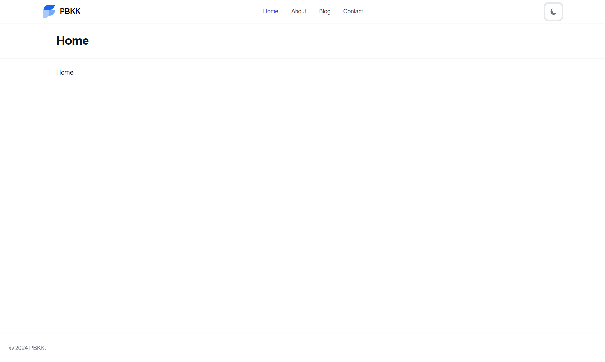
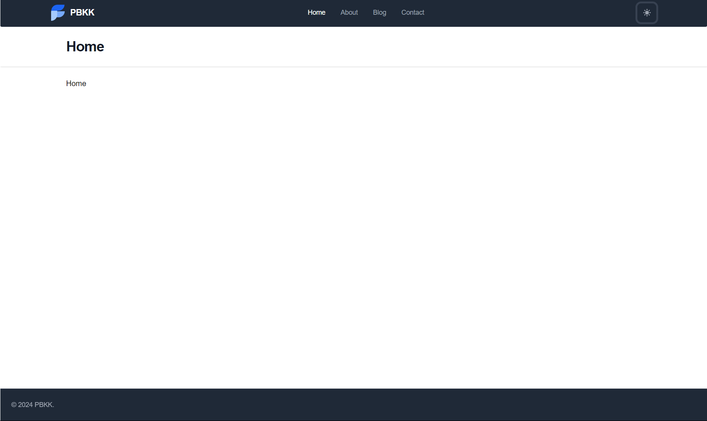

# Assignment 1 - Laravel Blade

| Nama | NRP |
| :----: | :-: |
| Iftala Zahri Sukmana | 5025221002 |


## Tech Stack
- Laravel 11
- MySQL
- Tailwind (Flowbite UI)

## Development

```
composer install
npm install
php artisan key:generate
php artisan migrate
php artisan db:seed
php artisan serve
```

## Project Updates
The way that I made this project different is that I use [Flowbite](https://flowbite.com/) as an Tailwind UI library to simplify my styling. Flowbite UI is responsible to my additional features that will be described below.


1. Footer
   
   The footer is obtained from the Flowbite library and has additional features too, such as supports dark mode and able to stick to the bottom of the display.

2. Dark mode toggle
   
   Dark mode toggle is also available on the right side of the top navbar. The purposes are to make user be able to switch in between dark/light mode only with a single click. It's possible by manipulating the tailwind class and using `localStorage` in JavaScript to invoke the classes. That means, The code needs additional Tailwind classes and styles to accomodate the light and dark modes.

   

   

## Changelog
```
2024-09-25 - docs: update Changelog
2024-09-25 - feat: add prettier
2024-09-25 - Merge pull request #2 from ifzahri/dependabot/npm_and_yarn/rollup-4.22.4
2024-09-25 - chore(deps-dev): bump rollup from 4.21.2 to 4.22.4
2024-09-25 - feat: add categories
2024-09-25 - feat: apply factories on user and posts using tinker
2024-09-22 - docs: update Changelog
2024-09-22 - feat: implement factories
2024-09-20 - Merge pull request #1 from ifzahri/dependabot/npm_and_yarn/vite-5.4.6
2024-09-20 - chore(deps-dev): bump vite from 5.4.3 to 5.4.6
2024-09-20 - chore: implement ORM on models
2024-09-20 - feat: add migrations and seeders
2024-09-20 - style: add styling to post and posts
2024-09-15 - feat: add posts
2024-09-11 - docs: update README
2024-09-11 - feat: add changes
2024-09-04 - feat: initial commit
```